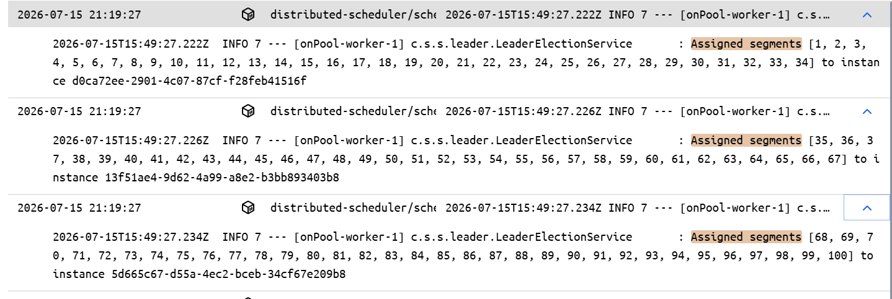

#Distributed Scheduler

## 1. Running the complete distributed system locally

Initially, I was concerned that my laptop (8 GB RAM) would not be able to run all the required components simultaneously: 

JobService 
SchedulingService 
ExecutorService 
Kafka 
ZooKeeper 

I reduced the JVM heap size for every Spring Boot service as well as Kafka and ZooKeeper. This allowed the complete distributed system to run comfortably on my local machine. 
### For Kafka
I edited the `kafka-server-start.bat` script to reduce the default heap size from 1 GB to 256 MB: 
`
IF ["%KAFKA_HEAP_OPTS%"] EQU [""] (
rem detect OS architecture
wmic os get osarchitecture | find /i "32-bit" >nul 2>&1
IF NOT ERRORLEVEL 1 (
set KAFKA_HEAP_OPTS=-Xmx512M -Xms512M
) ELSE (
set KAFKA_HEAP_OPTS=-Xmx1G -Xms1G
)
)` 
I replaced it with 
`IF ["%KAFKA_HEAP_OPTS%"] EQU [""] (
set KAFKA_HEAP_OPTS=-Xms128M -Xmx256M
)` 

### For ZooKeeper
I edited the `\bin\zkServer.cmd` script to reduce the default heap size from 1 GB to 256 MB: 
`call %JAVA% ^
"-Xms64m" ^
"-Xmx128m" ^
"-Dzookeeper.log.dir=%ZOO_LOG_DIR%" ^
"-Dzookeeper.log.file=%ZOO_LOG_FILE%" ^
"-XX:+HeapDumpOnOutOfMemoryError" ^
...`
Lesson: Infrastructure components do not always need their default heap sizes for local development. Proper JVM tuning makes local distributed-system development feasible. 

## 2. Kafka KRaft Architecture
KRaft mode introduces both a Broker and a Controller. 

The Broker is responsible for: 

storing topics 
serving producers 
serving consumers 

The Controller is responsible for: 

cluster metadata 
leader election 
partition assignments 

We can assign the Controller role to a Broker, but it is not required. The Controller can run on a separate node.
In KRaft mode, Kafka no longer depends on ZooKeeper for its own metadata management. 

## 3. Kafka Storage Formatting

Before starting Kafka for the first time, I had to initialize the metadata directory. 

I learned that Kafka cannot start until its metadata storage has been initialized with a Cluster ID. 

This is conceptually similar to initializing a database before first use. 
Navigate to `kafka_2.13-4.3.1\bin\windows` and  
run: 
`kafka-storage.bat random-uuid` then take this UUID(cluster-id) and  
run: 
`kafka-storage format -t <cluster-id> -c ..\..\config\kraft\server.properties` 
start Broker with: 
`kafka-server-start.bat ..\..\config\kraft\server.properties` 

## 6. Kafka Topic Management

I deleted a Kafka topic while my producer and consumer services were still running. 

This eventually caused broker instability and log directory failures. 

Lesson: Always stop producers and consumers before deleting or recreating Kafka topics. 

## 7. You can verify and inspect zookeeper znodes using the zkCli.sh command line tool.
ran `zkCli.cmd` 
To get content of znodes: 
`get /scheduling-service/segments/assignments` 

## 8.Set-up ZooKeeper and Kafka on Windows

### ZooKeeper
1. Download ZooKeeper from the official Apache website. 
2. Extract the downloaded archive to a directory of your choice. 
3. Navigate to the `conf` directory and create a copy of the `zoo_sample.cfg` file, renaming it to `zoo.cfg`. 
4. Open the `zoo.cfg` file in a text editor and configure the data directory and client port as needed. 
5. Start ZooKeeper by running the `zkServer.cmd` script located in the `bin` directory. 

### Kafka
1. Download Kafka from the official Apache website. 
2. Extract the downloaded archive to a directory of your choice. 
3. Navigate to the `config` directory and open the `server.properties` file in a text editor. Configure the necessary settings, such as broker ID, log directories, and listeners. 
4. generate a unique cluster ID by running the `kafka-storage.bat random-uuid` command in the `bin\windows` directory. Copy the generated UUID. 
5. Format the Kafka storage by running the `kafka-storage.bat format -t <cluster-id> -c ..\..\config\kraft\server.properties` command, replacing `<cluster-id>` with the UUID you generated in the previous step. This initializes the metadata storage for Kafka. 
6. Start Kafka by running the `kafka-server-start.bat` script located in the `bin\windows` directory, passing the path to the `server.properties` file as an argument. 
`kafka-server-start.bat ..\..\config\server.properties` 

## 9. To run docker Container of any service using local-profile and limited JVM heap size
1. Add Dockerfile + .gitignore to the root of the project and build the image 
   `docker build -t distributed-scheduler/jobservice:1.0 .` 
2. Run the container: `docker run -p 8084:8084 -e SPRING_PROFILES_ACTIVE=local -e JAVA_OPTS="-Xms128m -Xmx256m" distributed-scheduler/jobservice:1.0` 

## 10. Docker Concepts
### Docker Network:
"default bridge"(when you don't specify one) network->unrestricted network access to other containers ( within same  n/w ) using container IP addresses but not names. 
user-defined network-> containers can communicate with each other using container IP addresses or container names. 
For Container "A" localhost is container "A" itself.In network every container gets:an IP address+automatic DNS 

### Multiple Network:
A container can be connected to multiple Docker networks.For example a frontend container may be connected to a bridge network with external access, and a --internal network to communicate with containers running backend services that do not need external network access.

### IpAddress & ports:
By default, the container gets an IP address for every Docker network it attaches to. 
All ports of containers on bridge networks are accessible from the Docker host and other containers connected to the same network. hence need to use
-p flag to make a port available outside the host, and to containers in other bridge networks. 
       
## 11. Docker Compose

### Custom Kafka Image 
**Custom Kafka Docker Image** 

Instead of using a pre-configured Kafka distribution, this project builds a custom Kafka Docker image on top of the official apache/kafka image. 

The custom image consists of: 

`Dockerfile` – Builds the Kafka runtime image and packages the custom configuration. 
`server.properties` – Defines the broker configuration for running Kafka in KRaft mode. 
`start-kafka.sh` – Initializes Kafka storage by formatting it only on the first startup and then starts the broker. 
Docker Volume – Persists Kafka metadata (meta.properties) and topic logs across container restarts. 

**Why build a custom Kafka image?**
Building a custom image provides several advantages over using the default image as-is: 

1.Complete control over Kafka configuration through a version-controlled server.properties. 
2.Infrastructure as Code (IaC) by keeping the Dockerfile, startup scripts, and broker configuration alongside the application source code. 
3.Automated KRaft initialization, eliminating manual execution of kafka-storage.sh format. 
4.Persistent broker state using Docker volumes, ensuring metadata and topic data survive container recreation. 
5.Reproducible deployments, allowing any developer to build and start the same Kafka broker with a single docker compose up --build. 

### how to use Docker Compose
**docker compose build** :Builds or rebuilds the Docker images only. It does not create or start containers. 
**docker compose up** :Creates and starts containers. If an image doesn't exist, it will build it first (unless you use --no-build). 
**docker compose down** :Stops and removes containers, networks, but not named volumes created by docker compose up. It does not remove images unless you use the --rmi flag. 
**docker compose up --build** : Rebuilds the images and starts the containers. It is useful when you have made changes to the Dockerfile or application code and want to rebuild the images before starting the containers. 
### To check logs of a specific service
`docker compose logs <service-name>`

### To open a shell inside a running container
`docker compose exec -it <service-name> sh`
docker exec   -it   zookeeper   sh  
Execute a command in a running container-----Interactive terminal------Target container-----Command to run inside the container

### To run multiple instances of schedulingService using docker-compose
1.Remove the `container_name` and `hostname` directives from the schedulingService service in the docker-compose.yml file. 
This allows Docker Compose to automatically assign unique names to each instance of the service, enabling you to run multiple instances simultaneously. 
2.Remove port mapping for schedulingService in the docker-compose.yml file.
This prevents port conflicts when running multiple instances of the service, as each instance will use its own internal port within the Docker network. 
3.Run the following command to start multiple instances of schedulingService: 
`docker compose up --scale schedulingService=3`

Segment Assignments between multiple instances of schedulingService.

